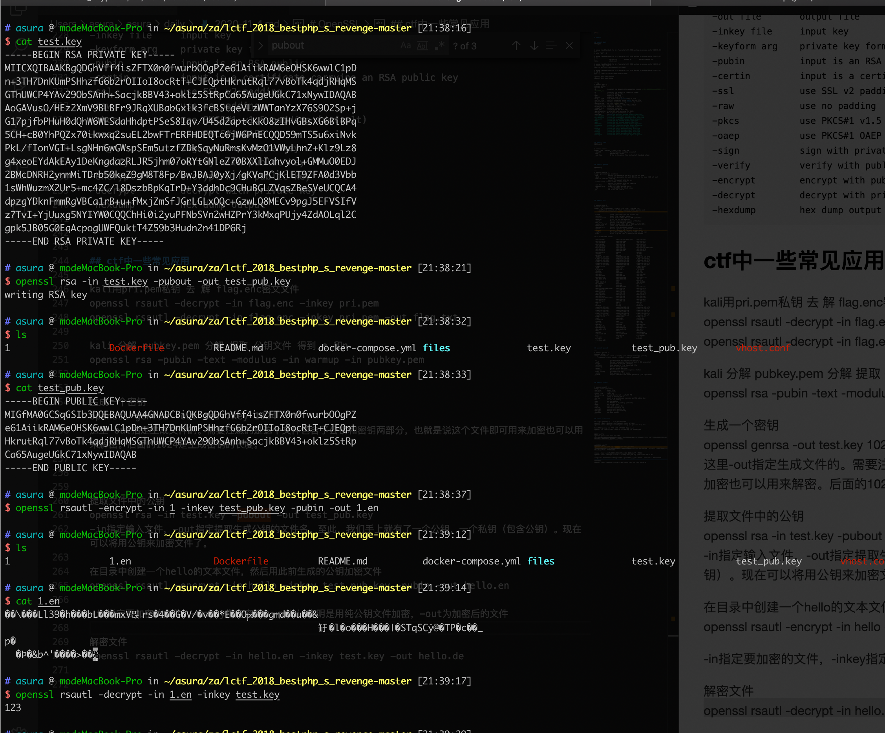

[toc]

# OpenSSL

## openssl dgst

摘要命令

```sh
# asura @ modeMacBook-Pro in ~/asura/za/lctf_2018_bestphp_s_revenge-master [20:57:04] C:1
$ echo "123" > 1

# asura @ modeMacBook-Pro in ~/asura/za/lctf_2018_bestphp_s_revenge-master [20:57:16]
$ ls
1                  Dockerfile         README.md          docker-compose.yml files              vhost.conf

# asura @ modeMacBook-Pro in ~/asura/za/lctf_2018_bestphp_s_revenge-master [20:57:17]
$ openssl dgst -md5 1
MD5(1)= ba1f2511fc30423bdbb183fe33f3dd0f

# asura @ modeMacBook-Pro in ~/asura/za/lctf_2018_bestphp_s_revenge-master [20:57:20]
$ md5 1
MD5 (1) = ba1f2511fc30423bdbb183fe33f3dd0f
```

openssl dgst -sha1 文件名
openssl dgst -md5 文件名

```sh
$ openssl dgst -
unknown option '-'
options are
-c              to output the digest with separating colons  //输出的摘要信息以分号隔离，和-hex同时使用
-r              to output the digest in coreutils format  
-d              to output debug info
-hex            output as hex dump
-binary         output in binary form
-sign   file    sign digest using private key in file
-verify file    verify a signature using public key in file
-prverify file  verify a signature using private key in file
-keyform arg    key file format (PEM)
-out filename   output to filename rather than stdout
-signature file signature to verify
-sigopt nm:v    signature parameter
-hmac key       create hashed MAC with key
-mac algorithm  create MAC (not neccessarily HMAC)
-macopt nm:v    MAC algorithm parameters or key
-gost-mac       to use the gost-mac message digest algorithm
-streebog512    to use the streebog512 message digest algorithm
-streebog256    to use the streebog256 message digest algorithm
-md_gost94      to use the md_gost94 message digest algorithm
-md4            to use the md4 message digest algorithm
-md5            to use the md5 message digest algorithm
-md5-sha1       to use the md5-sha1 message digest algorithm
-ripemd160      to use the ripemd160 message digest algorithm
-sha1           to use the sha1 message digest algorithm
-sha224         to use the sha224 message digest algorithm
-sha256         to use the sha256 message digest algorithm
-sha384         to use the sha384 message digest algorithm
-sha512         to use the sha512 message digest algorithm
-whirlpool      to use the whirlpool message digest algorithm
```

## openssl rand

生成随机数

```sh
$ openssl rand -
usage: rand [-base64 | -hex] [-out file] num
 -base64            Perform base64 encoding on output
 -hex               Hexadecimal output
 -out file          Write to the given file instead of standard output
```

## openssl genrsa

生成密钥对

```sh
$ openssl genrsa -
usage: genrsa [args] [numbits]
 -des            encrypt the generated key with DES in cbc mode
 -des3           encrypt the generated key with DES in ede cbc mode (168 bit key)
 -aes128, -aes192, -aes256
                 encrypt PEM output with cbc aes
 -camellia128, -camellia192, -camellia256
                 encrypt PEM output with cbc camellia
 -out file       output the key to 'file
 -passout arg    output file pass phrase source
 -f4             use F4 (0x10001) for the E value
 -3              use 3 for the E value
```

## openssl rsa

```sh
$ openssl rsa -h
Invalid cipher 'h'
usage: rsa [-ciphername] [-check] [-in file] [-inform fmt]
    [-modulus] [-noout] [-out file] [-outform fmt] [-passin src]
    [-passout src] [-pubin] [-pubout] [-sgckey] [-text]

 -check             Check consistency of RSA private key
 -in file           Input file (default stdin)
 -inform format     Input format (DER, NET or PEM (default))
 -modulus           Print the RSA key modulus
 -noout             Do not print encoded version of the key
 -out file          Output file (default stdout)
 -outform format    Output format (DER, NET or PEM (default PEM))
 -passin src        Input file passphrase source
 -passout src       Output file passphrase source
 -pubin             Expect a public key (default private key)
 -pubout            Output a public key (default private key)
 -sgckey            Use modified NET algorithm for IIS and SGC keys
 -text              Print in plain text in addition to encoded

Valid ciphername values:

 -AES-128-CBC              -AES-128-CBC-HMAC-SHA1    -AES-128-CFB
 -AES-128-CFB1             -AES-128-CFB8             -AES-128-CTR
 -AES-128-ECB              -AES-128-OFB              -AES-128-XTS
 -AES-192-CBC              -AES-192-CFB              -AES-192-CFB1
 -AES-192-CFB8             -AES-192-CTR              -AES-192-ECB
 -AES-192-OFB              -AES-256-CBC              -AES-256-CBC-HMAC-SHA1
 -AES-256-CFB              -AES-256-CFB1             -AES-256-CFB8
 -AES-256-CTR              -AES-256-ECB              -AES-256-OFB
 -AES-256-XTS              -AES128                   -AES192
 -AES256                   -BF                       -BF-CBC
 -BF-CFB                   -BF-ECB                   -BF-OFB
 -CAMELLIA-128-CBC         -CAMELLIA-128-CFB         -CAMELLIA-128-CFB1
 -CAMELLIA-128-CFB8        -CAMELLIA-128-ECB         -CAMELLIA-128-OFB
 -CAMELLIA-192-CBC         -CAMELLIA-192-CFB         -CAMELLIA-192-CFB1
 -CAMELLIA-192-CFB8        -CAMELLIA-192-ECB         -CAMELLIA-192-OFB
 -CAMELLIA-256-CBC         -CAMELLIA-256-CFB         -CAMELLIA-256-CFB1
 -CAMELLIA-256-CFB8        -CAMELLIA-256-ECB         -CAMELLIA-256-OFB
 -CAMELLIA128              -CAMELLIA192              -CAMELLIA256
 -CAST                     -CAST-cbc                 -CAST5-CBC
 -CAST5-CFB                -CAST5-ECB                -CAST5-OFB
 -ChaCha                   -DES                      -DES-CBC
 -DES-CFB                  -DES-CFB1                 -DES-CFB8
 -DES-ECB                  -DES-EDE                  -DES-EDE-CBC
 -DES-EDE-CFB              -DES-EDE-OFB              -DES-EDE3
 -DES-EDE3-CBC             -DES-EDE3-CFB             -DES-EDE3-CFB1
 -DES-EDE3-CFB8            -DES-EDE3-OFB             -DES-OFB
 -DES3                     -DESX                     -DESX-CBC
 -GOST 28147-89            -RC2                      -RC2-40-CBC
 -RC2-64-CBC               -RC2-CBC                  -RC2-CFB
 -RC2-ECB                  -RC2-OFB                  -RC4
 -RC4-40                   -RC4-HMAC-MD5             -aes-128-cbc
 -aes-128-cbc-hmac-sha1    -aes-128-cfb              -aes-128-cfb1
 -aes-128-cfb8             -aes-128-ctr              -aes-128-ecb
 -aes-128-gcm              -aes-128-ofb              -aes-128-xts
 -aes-192-cbc              -aes-192-cfb              -aes-192-cfb1
 -aes-192-cfb8             -aes-192-ctr              -aes-192-ecb
 -aes-192-gcm              -aes-192-ofb              -aes-256-cbc
 -aes-256-cbc-hmac-sha1    -aes-256-cfb              -aes-256-cfb1
 -aes-256-cfb8             -aes-256-ctr              -aes-256-ecb
 -aes-256-gcm              -aes-256-ofb              -aes-256-xts
 -aes128                   -aes192                   -aes256
 -bf                       -bf-cbc                   -bf-cfb
 -bf-ecb                   -bf-ofb                   -blowfish
 -camellia-128-cbc         -camellia-128-cfb         -camellia-128-cfb1
 -camellia-128-cfb8        -camellia-128-ecb         -camellia-128-ofb
 -camellia-192-cbc         -camellia-192-cfb         -camellia-192-cfb1
 -camellia-192-cfb8        -camellia-192-ecb         -camellia-192-ofb
 -camellia-256-cbc         -camellia-256-cfb         -camellia-256-cfb1
 -camellia-256-cfb8        -camellia-256-ecb         -camellia-256-ofb
 -camellia128              -camellia192              -camellia256
 -cast                     -cast-cbc                 -cast5-cbc
 -cast5-cfb                -cast5-ecb                -cast5-ofb
 -chacha                   -des                      -des-cbc
 -des-cfb                  -des-cfb1                 -des-cfb8
 -des-ecb                  -des-ede                  -des-ede-cbc
 -des-ede-cfb              -des-ede-ofb              -des-ede3
 -des-ede3-cbc             -des-ede3-cfb             -des-ede3-cfb1
 -des-ede3-cfb8            -des-ede3-ofb             -des-ofb
 -des3                     -desx                     -desx-cbc
 -gost89                   -gost89-cnt               -gost89-ecb
 -id-aes128-GCM            -id-aes192-GCM            -id-aes256-GCM
 -rc2                      -rc2-40-cbc               -rc2-64-cbc
 -rc2-cbc                  -rc2-cfb                  -rc2-ecb
 -rc2-ofb                  -rc4                      -rc4-40
 -rc4-hmac-md5

```

## openssl passwd

```sh
$ openssl passwd -h
unknown option '-h'
usage: passwd [-1 | -apr1 | -crypt] [-in file] [-noverify] [-quiet]
    [-reverse] [-salt string] [-stdin] [-table] [password]

 -1                 Use MD5 based BSD password algorithm 1
 -apr1              Use apr1 algorithm (Apache variant of BSD algorithm)
 -crypt             Use crypt algorithm (default)
 -in file           Read passwords from specified file
 -noverify          Do not verify password
 -quiet             Do not output warnings
 -reverse           Reverse table columns (requires -table)
 -salt string       Use specified salt
 -stdin             Read passwords from stdin
 -table             Output cleartext and hashed passwords (tab separated)
```

## openssl rsautl

```sh
$ openssl rsautl -h
Usage: rsautl [options]
-in file        input file
-out file       output file
-inkey file     input key
-keyform arg    private key format - default PEM
-pubin          input is an RSA public
-certin         input is a certificate carrying an RSA public key
-ssl            use SSL v2 padding
-raw            use no padding
-pkcs           use PKCS#1 v1.5 padding (default)
-oaep           use PKCS#1 OAEP
-sign           sign with private key
-verify         verify with public key
-encrypt        encrypt with public key
-decrypt        decrypt with private key
-hexdump        hex dump output
```

## ctf中一些常见应用

kali用pri.pem私钥 去 解 flag.enc密文文件
`openssl rsautl -decrypt -in flag.enc -inkey pri.pem`
`openssl rsautl -decrypt -in flag.enc -inkey pri.pem -out flag.txt`

kali 分解 pubkey.pem 分解 提取 公钥文件 得到 e 和n
`openssl rsa -pubin -text -modulus -in warmup -in pubkey.pem`

生成一个密钥
`openssl genrsa -out test.key 1024`
这里-out指定生成文件的。需要注意的是这个文件包含了公钥和密钥两部分，也就是说这个文件即可用来加密也可以用来解密。后面的1024是生成密钥的长度。

提取文件中的公钥
`openssl rsa -in test.key -pubout -out test_pub.key`
-in指定输入文件，-out指定提取生成公钥的文件名。至此，我们手上就有了一个公钥，一个私钥（包含公钥）。现在可以将用公钥来加密文件了。

在目录中创建一个hello的文本文件，然后用此前生成的公钥加密文件
`openssl rsautl -encrypt -in hello -inkey test_pub.key -pubin -out hello.en`

-in指定要加密的文件，-inkey指定密钥，-pubin表明是用纯公钥文件加密，-out为加密后的文件

解密文件
`openssl rsautl -decrypt -in hello.en -inkey test.key -out hello.de`


就成功解密了


